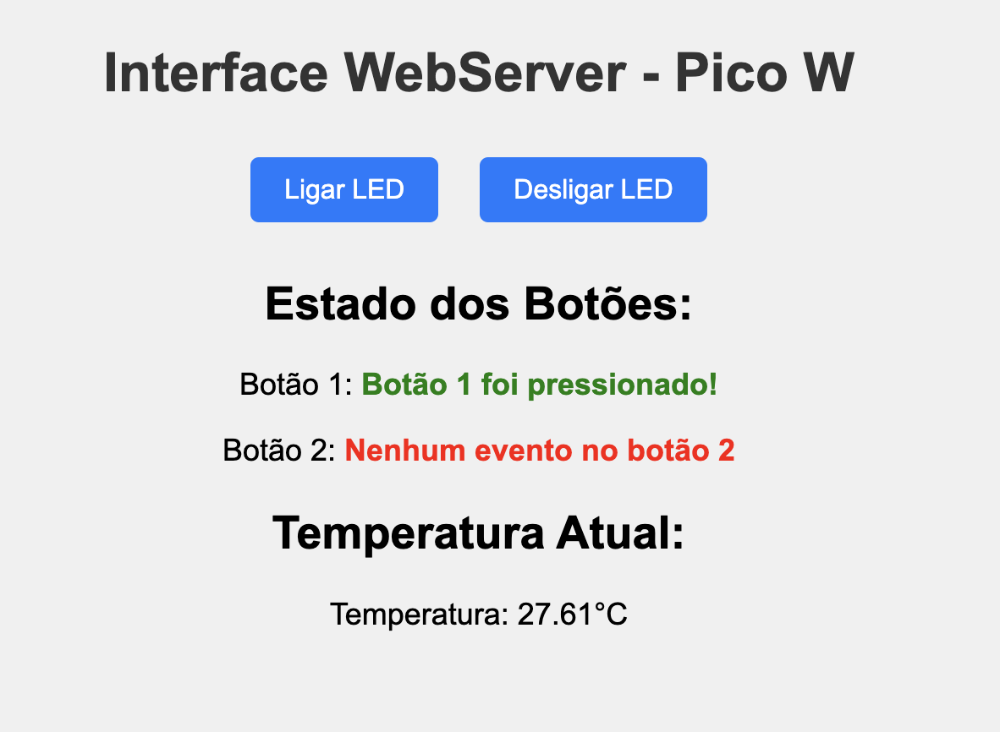

## Implementação de um Servidor Web na Raspberry Pi Pico W

Precisamos entender alguns conceitos sobre redes para trabalhar corretamente com Wifi, independente da placa que estamos utilizando, neste caso a nossa raspberry pi pico.

## O que é um Servidor Web?

No coração do desenvolvimento web está o modelo cliente-servidor, uma arquitetura de rede que separa clientes (navegadores) e servidores (onde os sites são armazenados e executados). Quando um usuário acessa um site, o navegador (cliente) envia uma solicitação HTTP ao servidor, que então processa a solicitação e envia de volta os dados necessários (geralmente em forma de HTML, CSS e JavaScript) para o navegador exibir a página web.

De forma mais abstrata funciona da seguinte forma


1. **Solicitação HTTP**: O cliente (browser) envia uma solicitação para um endereço IP específico em uma porta específica (geralmente a porta 80 para HTTP ou 443 para HTTPS) como, por exemplo, ao digitar `http://192.168.1.100`, o navegador envia uma requisição TCP para a porta 80 do IP `192.168.1.100`, esperando uma resposta compatível com o protocolo HTTP.
2. **Processamento**: O servidor recebe esta solicitação, a processa e determina o que o cliente está pedindo.
3. **Resposta**: O servidor envia de volta uma resposta contendo o conteúdo solicitado e um código de status HTTP (como 200 OK, 404 Not Found, etc.).

E por debaixo do capo, fazemos o seguinte.

### HTTP puro com TCP

No contexto do nosso servidor web, usamos o protocolo TCP para estabelecer conexão cliente-servidor.


A Pico W usa a pilha lwIP (Lightweight IP), que fornece implementações de protocolos TCP que vamos utilizar:

Acesse o site e de uma olhada na documentação para começar a ter familiaridade com algumas funções que vamos utilizar.

- [https://www.nongnu.org/lwip/2_1_x/group__tcp__raw.html](https://www.nongnu.org/lwip/2_1_x/group__tcp__raw.html)


### Stack TCP/IP

Os passos que devemos seguir para o servidor HTTP:

1. **Criação do socket TCP**:
   ```c
   struct tcp_pcb *pcb = tcp_new();
   ```

2. **Binding na porta 80**:
   ```c
   tcp_bind(pcb, IP_ADDR_ANY, 80);
   ```

3. **Modo de escuta**:
   ```c
   pcb = tcp_listen(pcb);
   tcp_accept(pcb, connection_callback);
   ```

A função `start_http_server` faz exatamente isso:

```c
static void start_http_server(void) {
    struct tcp_pcb *pcb = tcp_new();
    if (!pcb) {
        printf("Erro ao criar PCB\n");
        return;
    }

    if (tcp_bind(pcb, IP_ADDR_ANY, 80) != ERR_OK) {
        printf("Erro ao ligar na porta 80\n");
        return;
    }

    pcb = tcp_listen(pcb);
    tcp_accept(pcb, connection_callback);

    printf("Servidor HTTP iniciado na porta 80...\n");
}
```

### Processamento de Requisições HTTP

As solicitações HTTP são processadas na função de callback:

4. **Processamento de conexões**:
   ```c
   static err_t connection_callback(void *arg, struct tcp_pcb *newpcb, err_t err) {
       tcp_recv(newpcb, http_callback);
       return ERR_OK;
   }
   ```

5. **Processamento de requisições HTTP**:

    ```c
    static err_t http_callback(void *arg, struct tcp_pcb *tpcb, struct pbuf *p, err_t err) {
        if (p == NULL) {
            tcp_close(tpcb);
            return ERR_OK;
        }
        // Processa a requisição e envia uma resposta
        char *request = (char *)p->payload;
        
        // Verifica o tipo de solicitação e executa as ações correspondentes
        if (strstr(request, "GET /led/on")) {
            cyw43_arch_gpio_put(CYW43_WL_GPIO_LED_PIN, 1);
            printf("LED ligado\n");
        } else if (strstr(request, "GET /led/off")) {
            cyw43_arch_gpio_put(CYW43_WL_GPIO_LED_PIN, 0);
            printf("LED desligado\n");
        }

        // ... continua..
    }
    ```

6. **Geração de resposta HTML**:

    ```c
    //continuação
    static err_t http_callback(void *arg, struct tcp_pcb *tpcb, struct pbuf *p, err_t err) {
        if (p == NULL) {
            tcp_close(tpcb);
            return ERR_OK;
        }

        char *request = (char *)p->payload;

        if (strstr(request, "GET /led/on")) {
            cyw43_arch_gpio_put(CYW43_WL_GPIO_LED_PIN, 1);
            printf("LED ligado\n");
        } else if (strstr(request, "GET /led/off")) {
            cyw43_arch_gpio_put(CYW43_WL_GPIO_LED_PIN, 0);
            printf("LED desligado\n");
        }

        // Continuação...
        // Geração da resposta
        create_http_response();
        tcp_write(tpcb, http_response, strlen(http_response), TCP_WRITE_FLAG_COPY);
        pbuf_free(p);
        return ERR_OK;
    }
    ```

Gera o HTML de resposta para Client. 

   ```c
   void create_http_response() {
       snprintf(http_response, sizeof(http_response),
                "HTTP/1.1 200 OK\r\nContent-Type: text/html; charset=UTF-8\r\n\r\n"
                "<!DOCTYPE html>..."
                // Conteúdo HTML
       );
   }
   ```

### Step-by-Step

#### 1. Conecte-se à rede local  

> ⚠️ Não pode ser o wifi do insper

### 2. Ajuste o código 

No arquivo `webserver.c`, atualize:

```c
#define WIFI_SSID "your-wifi"  // sua rede wifi
#define WIFI_PASSWORD "your-password"  // sua senha
```

Compile e carregue o código para a Pico.  

### 3. Teste o webServer 

Abra um navegador web (browser) e digite o IP da raspberry pi pico

é esperado que abra a seguinte pagina web:



